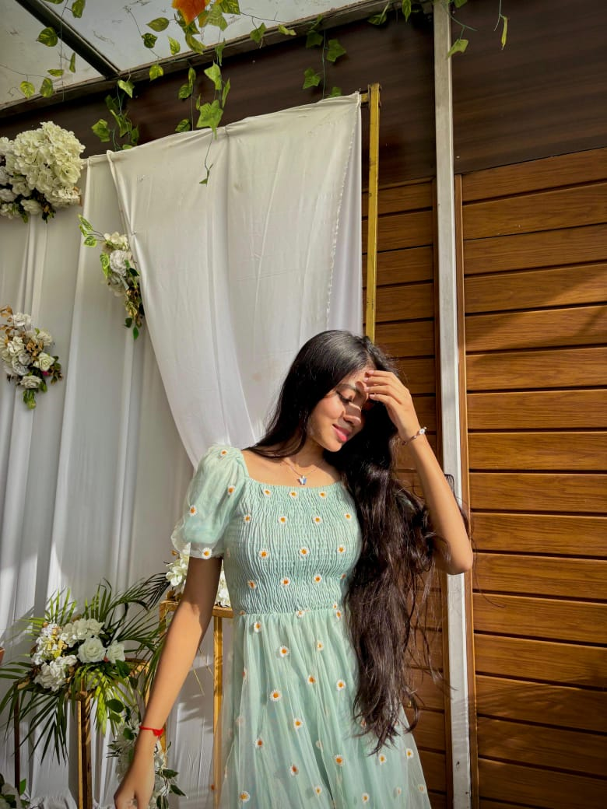

<!DOCTYPE html>
<html>
<head>
<meta charset="UTF-8">
<title>For My Love ❤️</title>

</head>

<body>

<!-- PASSWORD -->

<h1>Enter Our Love Password 💕</h1>
<input type="password" id="pass" placeholder="Enter password">
  
<button onclick="check()">Unlock Love ❤️</button>

<!-- MAIN CONTENT -->

<h1>Happy Valentine's Day My Love ❤️</h1>

<!-- MUSIC -->
<audio autoplay loop>
<source src="https://www2.cs.uic.edu/~i101/SoundFiles/StarWars60.wav" type="audio/wav">
</audio>

<!-- 5 PHOTOS -->

<!-- NOTEBOOK LETTER -->

<h2>My Special Letter 💌</h2>

My Love,  
From the day you came into my life, everything changed.  
Your smile is my happiness, your voice is my peace.  
I promise to stand beside you in every situation.  
You are my today, my tomorrow, and my forever ❤️  
Happy Valentine’s Day jaan 💖  

<h2 style="color:red;">I LOVE YOU SO MUCH ❤️</h2>

</body>
</html>
